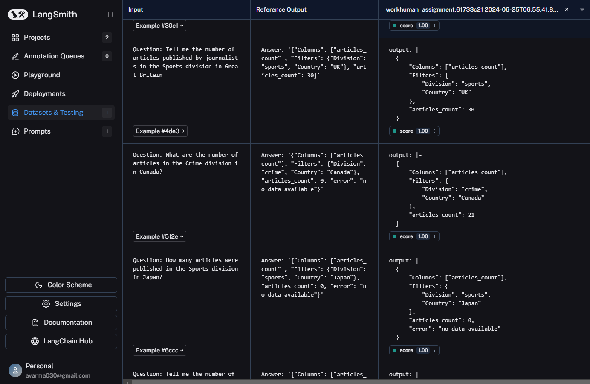

# Smart Assistant for an International Newspaper

This project processes natural language user queries regarding newspaper article counts in specific divisions and countries using an LLM, LangChain for development, and LangSmith for testing and evaluation.

it takes a query from user in natural language and based on the "division" and "country" mentioned in this query, it fetches the "articles_count" from a given dataset (dataFrame) and outputs it in a JSON dictionary format.  
e.g -  
user_query : Tell me the number of articles published by journalists in the Sports journalism division in the United States  
response : {
            'Columns': ['articles_count'],
            'Filters': {
                'Division': 'sports',
                'Country': 'USA'
                },
            'articles_count': 50
            }  

## Table of Contents
- [Installation](#installation)
- [Usage](#usage)
- [Evaluation and Testing](#evaluation-and-testing)

## Installation

**Clone the repository:**
```sh
git clone https://github.com/avarma030/wh.git
cd wh
```

## Usage

### Running the Application:
```sh
jupyter notebook WH_assessment_solution.ipynb
```

### Evaluation and Testing:
```sh
This application has been evaluated and tested with the help of LangSmith.
Please find the attached screenshots below for the evaluation results.
```

1. **Evaluation results over a custom dataset:**


------------------------------------------------------------------------

2. **Metrics of evaluation e.g Accuracy Score, Error Rate, and Latency:**
.png)

------------------------------------------------------------------------

3. **Completed sample evaluations and their metrics:**
.png)

------------------------------------------------------------------------

4. **Actual LLm run sequence and respective output:**
.png)

------------------------------------------------------------------------

5. **Actual LLm run sequence and respective output:**
.png)

------------------------------------------------------------------------

6. **Evaluation criteria and prompt:**
.png)

    

    
    


